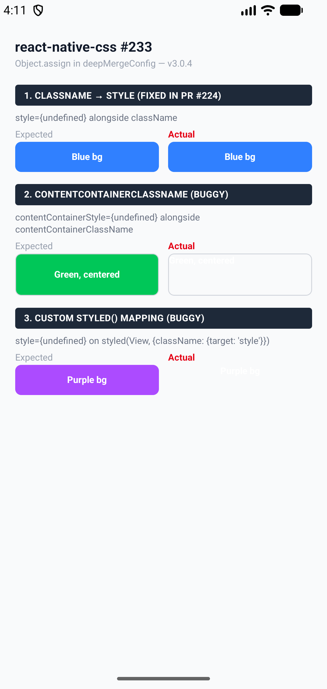
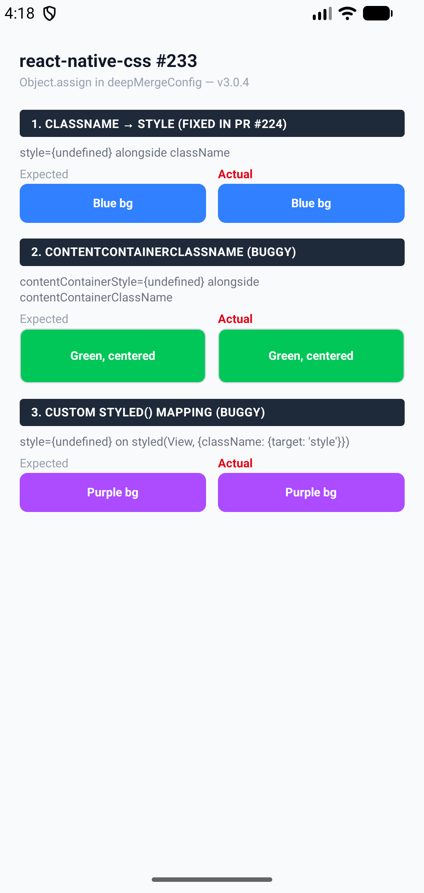

# react-native-css: `style={undefined}` destroys computed styles

Reproduction for [nativewind/react-native-css#233](https://github.com/nativewind/react-native-css/issues/233).

PR [#224](https://github.com/nativewind/react-native-css/pull/224) fixed the default `className → ["style"]` path, but two `Object.assign({}, left, right)` calls remain in `deepMergeConfig` ([lines 362 and 365](https://github.com/nativewind/react-native-css/blob/930095f/src/native/styles/index.ts#L362-L365)) that still copy `undefined` values, destroying computed styles for other targets.

## Affected code paths

| Target | Example | Bug? |
|--------|---------|------|
| `["style"]` (array) | `<View className="..." style={undefined} />` | Fixed in PR #224 |
| `["contentContainerStyle"]` (array, non-style) | `<ScrollView contentContainerClassName="..." contentContainerStyle={undefined} />` | **Buggy** |
| `"style"` (string) | `styled(View, { className: { target: "style" } })` | **Buggy** |

## Screenshots

<table>
<tr>
<th>Before (3.0.4 unpatched)</th>
<th>After (patched)</th>
</tr>
<tr>
<td></td>
<td></td>
</tr>
<tr>
<td>Tests 2 and 3 lose all computed styles when <code>*Style={undefined}</code> is passed alongside <code>*ClassName</code>.</td>
<td>All three tests render identically in Expected and Actual columns.</td>
</tr>
</table>

## Fix

Replace `Object.assign({}, left, right)` at [lines 362](https://github.com/nativewind/react-native-css/blob/930095f/src/native/styles/index.ts#L362) and [365](https://github.com/nativewind/react-native-css/blob/930095f/src/native/styles/index.ts#L365) with a merge that skips `undefined` values:

```js
// Before (buggy)
result = Object.assign({}, left, right);

// After (fixed)
result = { ...left };
if (right) {
  for (const key in right) {
    if (right[key] !== undefined) {
      result[key] = right[key];
    }
  }
}
```

## Reproduce & verify

### 1. See the bug (without patch)

```bash
# Remove patchedDependencies from package.json, then:
bun install --no-cache
npx expo start --clear
# Open in Expo Go on Android → Tests 2 & 3 are unstyled
```

### 2. Verify the fix (with patch)

The included `patches/react-native-css@3.0.4.patch` applies the fix above to both dist files. It is registered in `package.json` under `patchedDependencies`.

```bash
bun install
npx expo start --clear
# Open in Expo Go on Android → All 3 tests render identically
```

## Environment

- Expo SDK 55, react-native-css 3.0.4, NativeWind 5.0.0-preview.2
- `lightningcss` pinned to 1.30.1 (breaking changes in 1.30.2+)
- Bun 1.3.10
